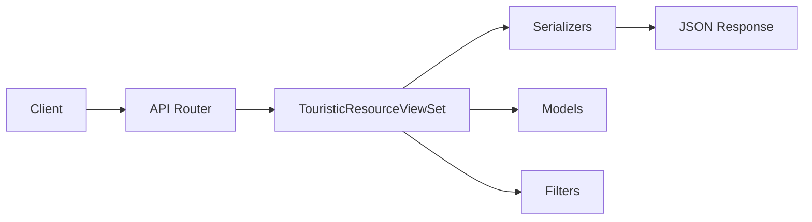

# Conception de l'API REST

## 🎯 Philosophie de l'API

L'API REST suit les principes RESTful et les conventions Django REST Framework pour offrir une interface cohérente et intuitive.

### Principes de Conception

- **RESTful** : Utilisation appropriée des verbes HTTP
- **Consistance** : Structures de données uniformes
- **Versioning** : API versionnée (v1)
- **Pagination** : Résultats paginés par défaut
- **Filtering** : Filtrage et recherche avancés
- **I18n** : Support multilingue intégré

## 🌍 Structure de l'API

### Base URL
```
http://localhost:8000/api/v1/
```

### Architecture RESTful



## 📊 Endpoints Principaux

### 1. Liste des Ressources
```
GET /api/v1/resources/
```

**Description** : Récupère la liste paginée des ressources touristiques actives

**Paramètres de requête** :
- `page` : Numéro de page (défaut: 1)
- `search` : Recherche textuelle dans nom/description
- `lang` : Langue de réponse (fr|en|de|es|it|nl)
- `ordering` : Tri (-created_at, creation_date, resource_id)

**Réponse** :
```json
{
  "count": 150,
  "next": "http://localhost:8000/api/v1/resources/?page=2",
  "previous": null,
  "results": [
    {
      "id": 1,
      "resource_id": "https://data.datatourisme.fr/resource/123",
      "resource_types": ["PlaceOfInterest", "Museum"],
      "name": "Musée du Louvre",
      "description": "Le plus grand musée d'art...",
      "location": {
        "type": "Point",
        "coordinates": [2.337644, 48.860611]
      },
      "main_image": "https://example.com/image.jpg",
      "price_range": {
        "min": 15,
        "currency": "EUR"
      }
    }
  ]
}
```

### 2. Détail d'une Ressource
```
GET /api/v1/resources/{id}/
```

**Description** : Récupère les détails complets d'une ressource

**Paramètres** :
- `id` : ID de la ressource
- `lang` : Langue de réponse

**Réponse** :
```json
{
  "id": 1,
  "resource_id": "https://data.datatourisme.fr/resource/123",
  "dc_identifier": "LOUVRE001",
  "resource_types": ["PlaceOfInterest", "Museum"],
  "name": "Musée du Louvre",
  "description": "Description complète du musée...",
  "location": {
    "type": "Point",
    "coordinates": [2.337644, 48.860611]
  },
  "address": {
    "streetAddress": "Rue de Rivoli",
    "postalCode": "75001",
    "addressLocality": "Paris"
  },
  "available_languages": ["fr", "en", "de"],
  "creation_date": "2024-01-15",
  "opening_hours": [
    {
      "day_of_week": 0,
      "day_name": "Lundi",
      "opens": "09:00:00",
      "closes": "18:00:00",
      "valid_from": "2024-01-01",
      "valid_through": "2024-12-31"
    }
  ],
  "prices": [
    {
      "min_price": 15,
      "max_price": 25,
      "currency": "EUR",
      "price_type": "Adulte",
      "description": "Tarif plein adulte"
    }
  ],
  "media": [
    {
      "url": "https://example.com/image.jpg",
      "title": "Vue extérieure",
      "mime_type": "image/jpeg",
      "is_main": true,
      "credits": "© Musée du Louvre"
    }
  ],
  "created_at": "2024-01-20T10:30:00Z",
  "updated_at": "2024-01-20T10:30:00Z"
}
```

### 3. Recherche par Proximité
```
GET /api/v1/resources/nearby/
```

**Description** : Recherche des ressources dans un rayon géographique

**Paramètres requis** :
- `lat` : Latitude (decimal)
- `lng` : Longitude (decimal)

**Paramètres optionnels** :
- `radius` : Rayon en mètres (défaut: 5000)
- `lang` : Langue de réponse

**Exemple** :
```
GET /api/v1/resources/nearby/?lat=48.8566&lng=2.3522&radius=10000&lang=en
```

### 4. Filtrage par Type
```
GET /api/v1/resources/by_type/
```

**Description** : Filtre les ressources par type

**Paramètres requis** :
- `type` : Type de ressource (ex: Museum, Restaurant)

**Exemple** :
```
GET /api/v1/resources/by_type/?type=Museum&lang=fr
```

## 🎨 Serializers

### TouristicResourceListSerializer

Serializer allégé pour les listes :

```python
class TouristicResourceListSerializer(serializers.ModelSerializer):
    name = serializers.SerializerMethodField()
    description = serializers.SerializerMethodField()
    main_image = serializers.SerializerMethodField()
    price_range = serializers.SerializerMethodField()
    
    class Meta:
        model = TouristicResource
        fields = [
            'id', 'resource_id', 'resource_types', 'name', 
            'description', 'location', 'main_image', 'price_range'
        ]
```

### TouristicResourceDetailSerializer

Serializer complet pour les détails :

```python
class TouristicResourceDetailSerializer(serializers.ModelSerializer):
    name = serializers.SerializerMethodField()
    description = serializers.SerializerMethodField()
    opening_hours = OpeningHoursSerializer(many=True, read_only=True)
    prices = PriceSpecificationSerializer(many=True, read_only=True)
    media = MediaRepresentationSerializer(many=True, read_only=True)
    
    class Meta:
        model = TouristicResource
        fields = [
            'id', 'resource_id', 'dc_identifier', 'resource_types',
            'name', 'description', 'location', 'address',
            'available_languages', 'creation_date',
            'opening_hours', 'prices', 'media',
            'created_at', 'updated_at'
        ]
```

## 🔍 Système de Filtrage

### Filtres Disponibles

1. **SearchFilter** : Recherche textuelle
   - Champs : `name`, `description`, `resource_types`
   - Usage : `?search=musée`

2. **OrderingFilter** : Tri des résultats
   - Champs : `created_at`, `creation_date`, `resource_id`
   - Usage : `?ordering=-created_at`

3. **Filtres géographiques** : Actions personnalisées
   - Proximité : Action `nearby`
   - Type : Action `by_type`

### Exemples de Filtrage

```bash
# Recherche textuelle
GET /api/v1/resources/?search=château

# Tri par date de création
GET /api/v1/resources/?ordering=-created_at

# Combinaison de filtres
GET /api/v1/resources/?search=musée&ordering=creation_date&lang=en
```

## 🌐 Support Multilingue

### Détection de la Langue

1. **Paramètre URL** : `?lang=en` (priorité haute)
2. **Header HTTP** : `Accept-Language: en-US,en;q=0.9` (priorité moyenne)
3. **Défaut** : Français (fr)

### Middleware de Langue

```python
class LanguageMiddleware(MiddlewareMixin):
    def process_request(self, request):
        # Détection automatique de la langue
        language = request.GET.get('lang', '').lower()
        
        if not language:
            accept_language = request.META.get('HTTP_ACCEPT_LANGUAGE', '')
            language = extract_language_from_accept_header(accept_language)
        
        # Validation et stockage
        supported_languages = ['fr', 'en', 'de', 'es', 'it', 'nl']
        if language not in supported_languages:
            language = 'fr'
        
        request.language = language
```

### Utilisation dans les Serializers

```python
def get_name(self, obj):
    language = self.context.get('language', 'fr')
    return obj.get_name(language)

def get_description(self, obj):
    language = self.context.get('language', 'fr')
    desc = obj.get_description(language)
    return desc[:200] + '...' if len(desc) > 200 else desc
```

## 📄 Pagination

### Configuration par Défaut

```python
REST_FRAMEWORK = {
    'DEFAULT_PAGINATION_CLASS': 'rest_framework.pagination.PageNumberPagination',
    'PAGE_SIZE': 20,
}
```

### Structure de Réponse Paginée

```json
{
  "count": 150,
  "next": "http://localhost:8000/api/v1/resources/?page=3",
  "previous": "http://localhost:8000/api/v1/resources/?page=1",
  "results": [...]
}
```

## ⚡ Optimisations de Performance

### Select Related et Prefetch

```python
class TouristicResourceViewSet(viewsets.ReadOnlyModelViewSet):
    def get_queryset(self):
        return TouristicResource.objects.select_related().prefetch_related(
            'opening_hours',
            'prices', 
            'media'
        ).filter(is_active=True)
```

### Cache Headers

```python
def list(self, request, *args, **kwargs):
    response = super().list(request, *args, **kwargs)
    response['Cache-Control'] = 'public, max-age=300'
    return response
```

## 🔒 Sécurité et Permissions

### Configuration CORS

```python
CORS_ALLOWED_ORIGINS = [
    "http://localhost:3000",
    "http://127.0.0.1:3000",
]

CORS_ALLOW_HEADERS = [
    'accept',
    'accept-encoding',
    'authorization',
    'content-type',
    'accept-language',
]
```

### Permissions

- **Lecture** : Publique (aucune authentification requise)
- **Écriture** : Réservée aux administrateurs (phase future)

## 📋 Codes de Statut HTTP

| Code | Situation | Description |
|------|-----------|-------------|
| 200 | Succès | Requête traitée avec succès |
| 400 | Erreur Client | Paramètres invalides |
| 404 | Non trouvé | Ressource inexistante |
| 500 | Erreur Serveur | Erreur interne |

### Gestion d'Erreurs

```json
{
  "error": "Les paramètres lat et lng sont requis",
  "code": "missing_parameters",
  "status": 400
}
```

## 📊 Monitoring et Métriques

### Endpoints de Santé

```python
# Futur : Health check endpoint
GET /api/health/
{
  "status": "healthy",
  "database": "connected",
  "cache": "available",
  "timestamp": "2024-01-20T10:30:00Z"
}
```

### Métriques de Performance

- **Temps de réponse moyen** : < 200ms
- **Taux d'erreur** : < 1%
- **Throughput** : 1000 req/min

## 🔮 Évolutions Futures

### Phase 2 - Améliorations Prévues

1. **Cache Redis** : Mise en cache des réponses
2. **GraphQL** : API alternative plus flexible
3. **WebSockets** : Mises à jour temps réel
4. **Authentification JWT** : Authentification sans état
5. **Rate Limiting** : Limitation du débit
6. **Analytics** : Métriques d'utilisation avancées

Cette conception d'API permet une utilisation simple et efficace tout en conservant la possibilité d'évolutions futures sans breaking changes.