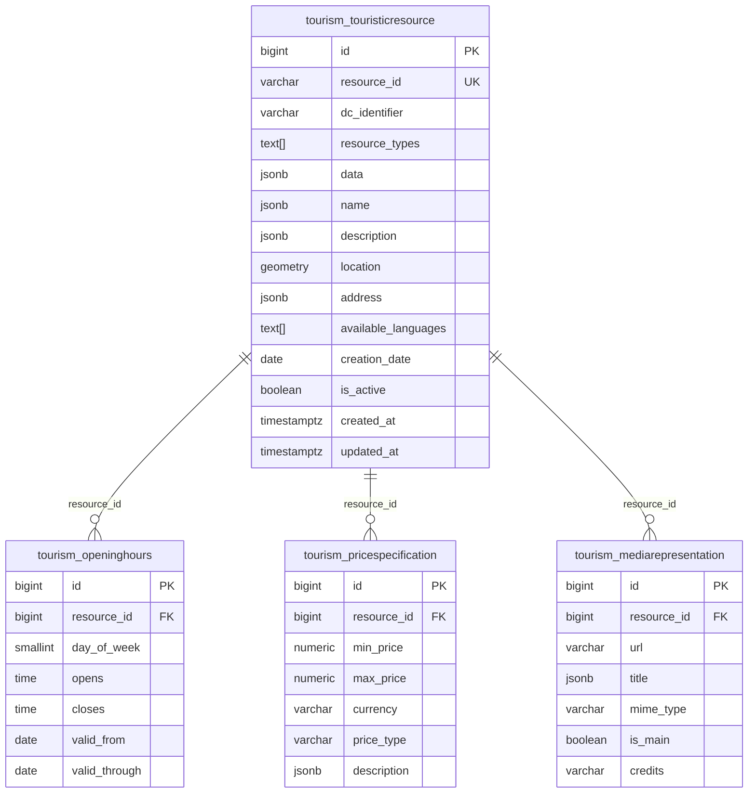

# Schéma de Base de Données

## 🗄️ Vue d'ensemble

L'application utilise PostgreSQL avec l'extension PostGIS pour gérer les données touristiques et géospatiales.

### Configuration de Base

- **SGBD** : PostgreSQL 15+
- **Extension** : PostGIS 3.3+
- **Encodage** : UTF-8
- **Timezone** : UTC
- **SRID par défaut** : 4326 (WGS84)

## 📊 Schéma Relationnel

### Diagramme ERD



## 🏛️ Table Principale : tourism_touristicresource

### Structure Détaillée

```sql
CREATE TABLE tourism_touristicresource (
    id bigserial PRIMARY KEY,
    resource_id varchar(255) NOT NULL UNIQUE,
    dc_identifier varchar(255) NOT NULL,
    resource_types text[] NOT NULL DEFAULT '{}',
    data jsonb NOT NULL DEFAULT '{}',
    name jsonb NOT NULL DEFAULT '{}',
    description jsonb NOT NULL DEFAULT '{}',
    location geometry(POINT, 4326),
    address jsonb,
    available_languages text[] NOT NULL DEFAULT '{}',
    creation_date date,
    is_active boolean NOT NULL DEFAULT true,
    created_at timestamptz NOT NULL DEFAULT now(),
    updated_at timestamptz NOT NULL DEFAULT now()
);
```

### Index Optimisés

```sql
-- Index unique sur resource_id
CREATE UNIQUE INDEX tourism_touristicresource_resource_id_key 
ON tourism_touristicresource (resource_id);

-- Index pour les requêtes par activité
CREATE INDEX tourism_touristicresource_is_active_idx 
ON tourism_touristicresource (is_active);

-- Index spatial pour géolocalisation
CREATE INDEX tourism_touristicresource_location_gist_idx 
ON tourism_touristicresource USING GIST (location);

-- Index GIN pour recherche JSON
CREATE INDEX tourism_touristicresource_data_gin_idx 
ON tourism_touristicresource USING GIN (data);

CREATE INDEX tourism_touristicresource_name_gin_idx 
ON tourism_touristicresource USING GIN (name);

CREATE INDEX tourism_touristicresource_description_gin_idx 
ON tourism_touristicresource USING GIN (description);

-- Index pour tri chronologique
CREATE INDEX tourism_touristicresource_created_at_idx 
ON tourism_touristicresource (created_at);

-- Index composite pour filtres fréquents
CREATE INDEX tourism_touristicresource_types_active_idx 
ON tourism_touristicresource USING GIN (resource_types) 
WHERE is_active = true;
```

### Contraintes

```sql
-- Contrainte de validation sur resource_types
ALTER TABLE tourism_touristicresource 
ADD CONSTRAINT valid_resource_types 
CHECK (array_length(resource_types, 1) > 0);

-- Contrainte sur available_languages
ALTER TABLE tourism_touristicresource 
ADD CONSTRAINT valid_languages 
CHECK (available_languages <@ ARRAY['fr','en','de','es','it','nl']);

-- Contrainte sur location (optionnelle mais valide si présente)
ALTER TABLE tourism_touristicresource 
ADD CONSTRAINT valid_location 
CHECK (location IS NULL OR ST_IsValid(location));
```

## ⏰ Table : tourism_openinghours

### Structure

```sql
CREATE TABLE tourism_openinghours (
    id bigserial PRIMARY KEY,
    resource_id bigint NOT NULL REFERENCES tourism_touristicresource(id) ON DELETE CASCADE,
    day_of_week smallint NOT NULL CHECK (day_of_week >= 0 AND day_of_week <= 6),
    opens time NOT NULL,
    closes time NOT NULL,
    valid_from date,
    valid_through date
);
```

### Index

```sql
-- Index pour requêtes par ressource
CREATE INDEX tourism_openinghours_resource_id_idx 
ON tourism_openinghours (resource_id);

-- Index composite pour recherche par jour
CREATE INDEX tourism_openinghours_resource_day_idx 
ON tourism_openinghours (resource_id, day_of_week);

-- Index pour validité temporelle
CREATE INDEX tourism_openinghours_validity_idx 
ON tourism_openinghours (valid_from, valid_through);
```

### Contraintes

```sql
-- Cohérence des heures
ALTER TABLE tourism_openinghours 
ADD CONSTRAINT valid_hours 
CHECK (opens < closes);

-- Cohérence des dates
ALTER TABLE tourism_openinghours 
ADD CONSTRAINT valid_dates 
CHECK (valid_from IS NULL OR valid_through IS NULL OR valid_from <= valid_through);
```

## 💰 Table : tourism_pricespecification

### Structure

```sql
CREATE TABLE tourism_pricespecification (
    id bigserial PRIMARY KEY,
    resource_id bigint NOT NULL REFERENCES tourism_touristicresource(id) ON DELETE CASCADE,
    min_price numeric(10,2),
    max_price numeric(10,2),
    currency varchar(3) NOT NULL DEFAULT 'EUR',
    price_type varchar(100) NOT NULL,
    description jsonb NOT NULL DEFAULT '{}'
);
```

### Index

```sql
-- Index pour requêtes par ressource
CREATE INDEX tourism_pricespecification_resource_id_idx 
ON tourism_pricespecification (resource_id);

-- Index pour recherche par prix
CREATE INDEX tourism_pricespecification_price_idx 
ON tourism_pricespecification (min_price, max_price);

-- Index pour type de prix
CREATE INDEX tourism_pricespecification_type_idx 
ON tourism_pricespecification (price_type);
```

### Contraintes

```sql
-- Prix positifs
ALTER TABLE tourism_pricespecification 
ADD CONSTRAINT positive_prices 
CHECK (min_price IS NULL OR min_price >= 0);

-- Cohérence min/max
ALTER TABLE tourism_pricespecification 
ADD CONSTRAINT coherent_prices 
CHECK (min_price IS NULL OR max_price IS NULL OR min_price <= max_price);

-- Code devise valide
ALTER TABLE tourism_pricespecification 
ADD CONSTRAINT valid_currency 
CHECK (currency ~ '^[A-Z]{3}$');
```

## 🖼️ Table : tourism_mediarepresentation

### Structure

```sql
CREATE TABLE tourism_mediarepresentation (
    id bigserial PRIMARY KEY,
    resource_id bigint NOT NULL REFERENCES tourism_touristicresource(id) ON DELETE CASCADE,
    url varchar(200) NOT NULL,
    title jsonb NOT NULL DEFAULT '{}',
    mime_type varchar(100) NOT NULL,
    is_main boolean NOT NULL DEFAULT false,
    credits varchar(255) NOT NULL DEFAULT ''
);
```

### Index

```sql
-- Index pour requêtes par ressource
CREATE INDEX tourism_mediarepresentation_resource_id_idx 
ON tourism_mediarepresentation (resource_id);

-- Index pour média principal
CREATE INDEX tourism_mediarepresentation_main_idx 
ON tourism_mediarepresentation (resource_id, is_main);

-- Index pour type MIME
CREATE INDEX tourism_mediarepresentation_mime_idx 
ON tourism_mediarepresentation (mime_type);
```

### Contraintes

```sql
-- URL valide
ALTER TABLE tourism_mediarepresentation 
ADD CONSTRAINT valid_url 
CHECK (url ~ '^https?://');

-- Un seul média principal par ressource
CREATE UNIQUE INDEX tourism_mediarepresentation_unique_main 
ON tourism_mediarepresentation (resource_id) 
WHERE is_main = true;
```

## 🗺️ Fonctionnalités PostGIS

### Extension et Configuration

```sql
-- Activation de PostGIS
CREATE EXTENSION IF NOT EXISTS postgis;
CREATE EXTENSION IF NOT EXISTS postgis_topology;

-- Vérification de la version
SELECT PostGIS_Version();
```

### Système de Coordonnées

```sql
-- Système de référence spatiale utilisé
SELECT * FROM spatial_ref_sys WHERE srid = 4326;

-- WGS84 - World Geodetic System 1984
-- Utilisé par GPS et la plupart des APIs géographiques
```

### Requêtes Spatiales Courantes

```sql
-- Distance entre deux points (en mètres)
SELECT ST_Distance(
    ST_GeogFromText('POINT(2.3522 48.8566)'),  -- Paris
    location::geography
) as distance_meters
FROM tourism_touristicresource
WHERE location IS NOT NULL;

-- Ressources dans un rayon (PostGIS géographique)
SELECT * FROM tourism_touristicresource
WHERE ST_DWithin(
    location::geography,
    ST_GeogFromText('POINT(2.3522 48.8566)'),
    10000  -- 10km en mètres
);

-- Ressources dans un polygone
SELECT * FROM tourism_touristicresource
WHERE ST_Contains(
    ST_GeomFromText('POLYGON((...))', 4326),
    location
);

-- Point le plus proche
SELECT *, ST_Distance(
    location::geography,
    ST_GeogFromText('POINT(2.3522 48.8566)')
) as distance
FROM tourism_touristicresource
WHERE location IS NOT NULL
ORDER BY distance
LIMIT 1;
```

## 📊 Statistiques et Analyse

### Taille des Tables

```sql
-- Taille des tables
SELECT 
    schemaname,
    tablename,
    pg_size_pretty(pg_total_relation_size(schemaname||'.'||tablename)) as size
FROM pg_tables 
WHERE schemaname = 'public' 
AND tablename LIKE 'tourism_%'
ORDER BY pg_total_relation_size(schemaname||'.'||tablename) DESC;
```

### Utilisation des Index

```sql
-- Utilisation des index
SELECT 
    schemaname,
    tablename,
    indexname,
    idx_tup_read,
    idx_tup_fetch
FROM pg_stat_user_indexes 
WHERE schemaname = 'public'
ORDER BY idx_tup_read DESC;
```

### Performance des Requêtes

```sql
-- Plans d'exécution pour optimisation
EXPLAIN (ANALYZE, BUFFERS) 
SELECT * FROM tourism_touristicresource 
WHERE ST_DWithin(
    location::geography,
    ST_GeogFromText('POINT(2.3522 48.8566)'),
    5000
);
```

## 🔧 Maintenance et Optimisation

### Vacuum et Analyse

```sql
-- Maintenance régulière
VACUUM ANALYZE tourism_touristicresource;
VACUUM ANALYZE tourism_openinghours;
VACUUM ANALYZE tourism_pricespecification;
VACUUM ANALYZE tourism_mediarepresentation;

-- Mise à jour des statistiques spatiales
SELECT UpdateGeometrySRID('tourism_touristicresource', 'location', 4326);
```

### Réindexation

```sql
-- Réindexation des index spatiaux
REINDEX INDEX tourism_touristicresource_location_gist_idx;

-- Réindexation des index GIN
REINDEX INDEX tourism_touristicresource_data_gin_idx;
```

## 📈 Monitoring et Métriques

### Requêtes de Monitoring

```sql
-- Nombre de ressources par type
SELECT 
    unnest(resource_types) as type,
    COUNT(*) as count
FROM tourism_touristicresource 
WHERE is_active = true
GROUP BY type
ORDER BY count DESC;

-- Distribution géographique
SELECT 
    ST_ClusterKMeans(location, 10) OVER() as cluster,
    COUNT(*) as resources_count
FROM tourism_touristicresource
WHERE location IS NOT NULL
GROUP BY cluster;

-- Qualité des données
SELECT 
    COUNT(*) as total,
    COUNT(location) as with_location,
    COUNT(*) FILTER (WHERE jsonb_array_length(to_jsonb(available_languages)) > 1) as multilingual,
    AVG(jsonb_array_length(to_jsonb(resource_types))) as avg_types
FROM tourism_touristicresource;
```

## 🚀 Évolutions Futures

### Optimisations Phase 2

1. **Partitioning** : Par région géographique
2. **Materialized Views** : Pour les agrégations fréquentes
3. **Index partiels** : Pour les requêtes spécialisées
4. **Compression** : Pour les données JSON volumineuses

### Extensions Prévues

```sql
-- Extensions pour Phase 2
CREATE EXTENSION IF NOT EXISTS pg_trgm;     -- Recherche floue
CREATE EXTENSION IF NOT EXISTS btree_gin;   -- Index composites
CREATE EXTENSION IF NOT EXISTS pg_stat_statements; -- Analyse performance
```

Cette conception de base de données offre des performances optimales pour les requêtes géospatiales et la recherche multilingue tout en maintenant l'intégrité référentielle.