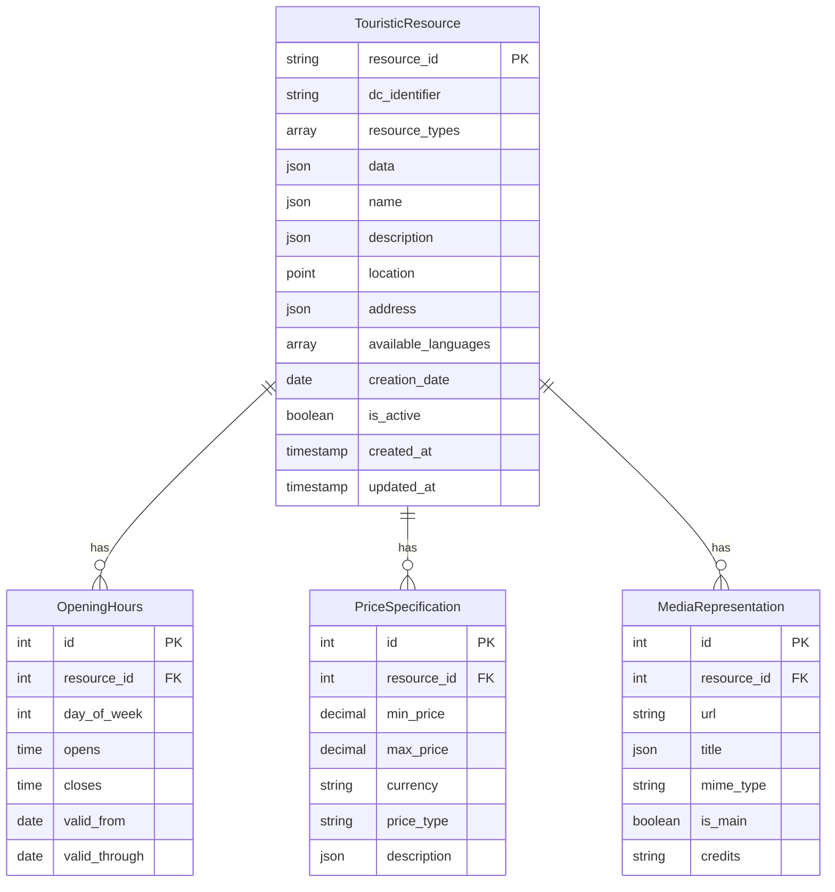

# Documentation des Modèles de Données

## 📊 Vue d'ensemble des Modèles

L'application utilise 4 modèles principaux pour représenter les ressources touristiques et leurs données associées.

### 🏗️ Diagramme des Relations



## 🏛️ Modèle Principal : TouristicResource

### Description
Modèle central représentant une ressource touristique (lieu, activité, hébergement, etc.).

### Champs

| Champ | Type | Description | Contraintes |
|-------|------|-------------|-------------|
| `resource_id` | CharField(255) | Identifiant unique (@id JSON-LD) | UNIQUE, INDEX |
| `dc_identifier` | CharField(255) | Identifiant Dublin Core | INDEX |
| `resource_types` | ArrayField | Types de ressource (@type JSON-LD) | DEFAULT=[] |
| `data` | JSONField | Données JSON-LD complètes | DEFAULT={} |
| `name` | JSONField | Nom multilingue | DEFAULT={} |
| `description` | JSONField | Description multilingue | DEFAULT={} |
| `location` | PointField | Coordonnées géographiques | SRID=4326, NULLABLE |
| `address` | JSONField | Adresse structurée | NULLABLE |
| `available_languages` | ArrayField | Langues disponibles | DEFAULT=[] |
| `creation_date` | DateField | Date de création de la ressource | NULLABLE |
| `is_active` | BooleanField | Ressource active | DEFAULT=True |
| `created_at` | DateTimeField | Date de création en base | AUTO_NOW_ADD |
| `updated_at` | DateTimeField | Date de dernière modification | AUTO_NOW |

### Index

```python
class Meta:
    indexes = [
        GinIndex(fields=['data']),           # Index GIN pour JSON
        GinIndex(fields=['name']),           # Index GIN pour recherche nom
        GinIndex(fields=['description']),    # Index GIN pour recherche description
        models.Index(fields=['created_at']), # Index pour tri chronologique
        models.Index(fields=['is_active']),  # Index pour filtrage actif
    ]
```

### Méthodes

```python
def get_name(self, language='fr'):
    """Récupère le nom dans la langue spécifiée avec fallback vers fr"""
    
def get_description(self, language='fr'):
    """Récupère la description dans la langue spécifiée avec fallback vers fr"""
    
def __str__(self):
    """Représentation string basée sur le nom français"""
```

### Exemple d'Utilisation

```python
# Création d'une ressource
resource = TouristicResource.objects.create(
    resource_id="https://example.com/resource/123",
    dc_identifier="RES123",
    resource_types=["PlaceOfInterest", "Museum"],
    name={
        "fr": "Musée du Louvre",
        "en": "Louvre Museum"
    },
    description={
        "fr": "Le plus grand musée du monde",
        "en": "The world's largest museum"
    },
    location=Point(2.337644, 48.860611),  # Paris
    available_languages=["fr", "en"]
)

# Utilisation des méthodes
print(resource.get_name('en'))  # "Louvre Museum"
print(resource.get_name('de'))  # "Musée du Louvre" (fallback)
```

## ⏰ Modèle : OpeningHours

### Description
Représente les horaires d'ouverture d'une ressource touristique.

### Champs

| Champ | Type | Description | Contraintes |
|-------|------|-------------|-------------|
| `resource` | ForeignKey | Ressource associée | CASCADE |
| `day_of_week` | IntegerField | Jour de la semaine (0=Lundi) | CHOICES 0-6 |
| `opens` | TimeField | Heure d'ouverture | |
| `closes` | TimeField | Heure de fermeture | |
| `valid_from` | DateField | Date de début de validité | NULLABLE |
| `valid_through` | DateField | Date de fin de validité | NULLABLE |

### Choix pour day_of_week

```python
DAY_CHOICES = [
    (0, 'Lundi'),
    (1, 'Mardi'),
    (2, 'Mercredi'),
    (3, 'Jeudi'),
    (4, 'Vendredi'),
    (5, 'Samedi'),
    (6, 'Dimanche'),
]
```

### Exemple d'Utilisation

```python
# Ajout d'horaires
OpeningHours.objects.create(
    resource=resource,
    day_of_week=0,  # Lundi
    opens=time(9, 0),
    closes=time(18, 0),
    valid_from=date(2024, 1, 1),
    valid_through=date(2024, 12, 31)
)
```

## 💰 Modèle : PriceSpecification

### Description
Spécifications de prix pour une ressource touristique.

### Champs

| Champ | Type | Description | Contraintes |
|-------|------|-------------|-------------|
| `resource` | ForeignKey | Ressource associée | CASCADE |
| `min_price` | DecimalField | Prix minimum | NULLABLE, 2 décimales |
| `max_price` | DecimalField | Prix maximum | NULLABLE, 2 décimales |
| `currency` | CharField(3) | Code devise ISO | DEFAULT='EUR' |
| `price_type` | CharField(100) | Type de tarif | |
| `description` | JSONField | Description multilingue | DEFAULT={} |

### Exemple d'Utilisation

```python
# Ajout d'un tarif
PriceSpecification.objects.create(
    resource=resource,
    min_price=Decimal('15.00'),
    max_price=Decimal('25.00'),
    currency='EUR',
    price_type='Adulte',
    description={
        "fr": "Tarif plein adulte",
        "en": "Full adult price"
    }
)
```

## 🖼️ Modèle : MediaRepresentation

### Description
Représentations média (images, vidéos) associées à une ressource.

### Champs

| Champ | Type | Description | Contraintes |
|-------|------|-------------|-------------|
| `resource` | ForeignKey | Ressource associée | CASCADE |
| `url` | URLField | URL du média | |
| `title` | JSONField | Titre multilingue | DEFAULT={} |
| `mime_type` | CharField(100) | Type MIME | |
| `is_main` | BooleanField | Image principale | DEFAULT=False |
| `credits` | CharField(255) | Crédits/attribution | |

### Exemple d'Utilisation

```python
# Ajout d'un média
MediaRepresentation.objects.create(
    resource=resource,
    url="https://example.com/image.jpg",
    title={
        "fr": "Vue extérieure du musée",
        "en": "Exterior view of the museum"
    },
    mime_type="image/jpeg",
    is_main=True,
    credits="© Musée du Louvre"
)
```

## 🔍 Requêtes Courantes

### Recherche par Proximité

```python
from django.contrib.gis.geos import Point
from django.contrib.gis.measure import Distance

# Point de référence (Paris)
point = Point(2.3522, 48.8566)

# Ressources dans un rayon de 10km
nearby_resources = TouristicResource.objects.filter(
    location__distance_lte=(point, Distance(km=10))
).order_by('location')
```

### Recherche Multilingue

```python
# Recherche dans le nom français
resources = TouristicResource.objects.filter(
    name__fr__icontains='musée'
)

# Recherche dans toutes les langues
from django.db.models import Q

resources = TouristicResource.objects.filter(
    Q(name__fr__icontains='museum') |
    Q(name__en__icontains='museum')
)
```

### Filtrage par Type

```python
# Ressources de type musée
museums = TouristicResource.objects.filter(
    resource_types__contains=['Museum']
)

# Ressources avec horaires aujourd'hui
from datetime import date

today = date.today()
open_today = TouristicResource.objects.filter(
    opening_hours__day_of_week=today.weekday(),
    opening_hours__valid_from__lte=today,
    opening_hours__valid_through__gte=today
).distinct()
```

## ⚡ Optimisations de Performance

### Index Recommandés

```sql
-- Index composites pour requêtes fréquentes
CREATE INDEX idx_resource_type_active 
ON tourism_touristicresource (resource_types, is_active);

-- Index spatial pour géolocalisation
CREATE INDEX idx_resource_location_gist 
ON tourism_touristicresource USING GIST (location);

-- Index pour recherche textuelle
CREATE INDEX idx_resource_name_gin 
ON tourism_touristicresource USING GIN (name);
```

### Select Related / Prefetch

```python
# Optimisation des requêtes avec relations
resources = TouristicResource.objects.select_related().prefetch_related(
    'opening_hours',
    'prices',
    'media'
).filter(is_active=True)
```

## 🧪 Tests des Modèles

### Exemple de Test

```python
def test_touristicresource_multilingual():
    resource = TouristicResource.objects.create(
        resource_id="test-123",
        name={"fr": "Test FR", "en": "Test EN"}
    )
    
    assert resource.get_name('fr') == "Test FR"
    assert resource.get_name('en') == "Test EN"
    assert resource.get_name('de') == "Test FR"  # Fallback
```

## 📝 Migrations

### Migration Initiale

La migration `0001_initial.py` crée :
- Toutes les tables avec contraintes
- Index spatiaux PostGIS
- Index GIN pour recherche JSON
- Relations FK avec CASCADE

### Évolutions Futures

Prévisions pour la Phase 2 :
- Champs de cache dénormalisés
- Tables d'audit pour historique
- Index optimisés pour Elasticsearch
- Partitioning par région géographique

Cette structure de données robuste permet une gestion efficace des ressources touristiques tout en conservant la flexibilité du format JSON-LD original.