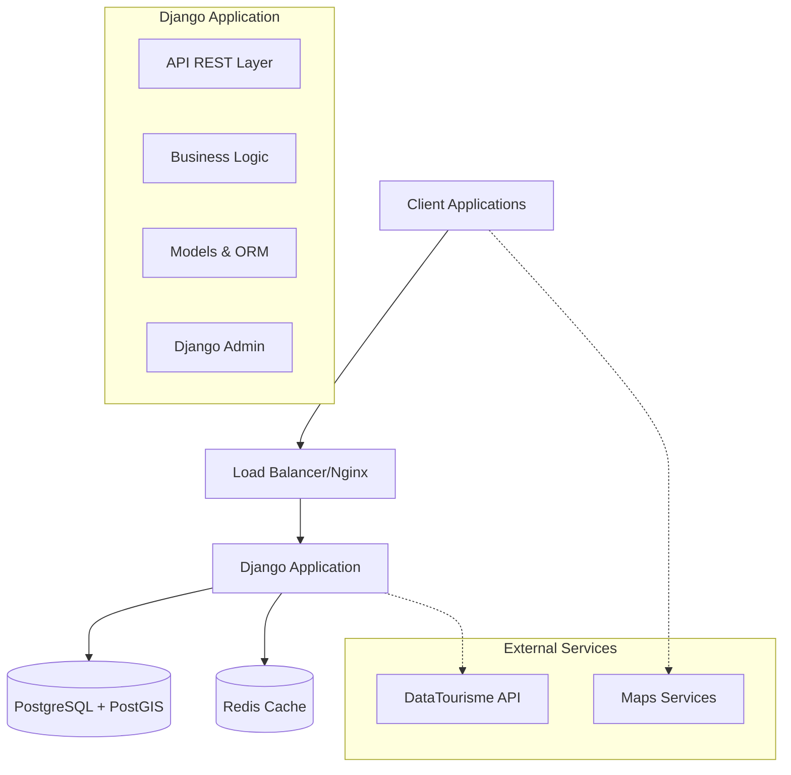
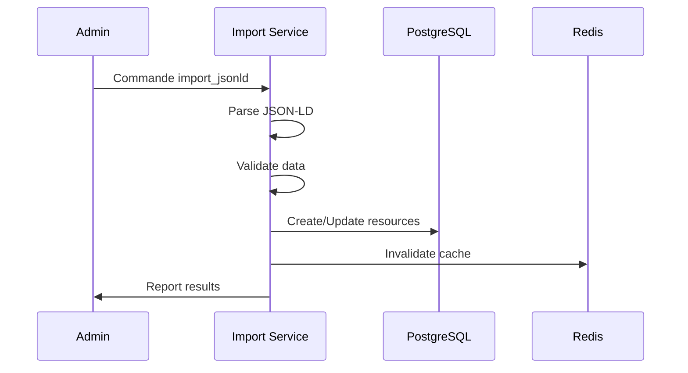
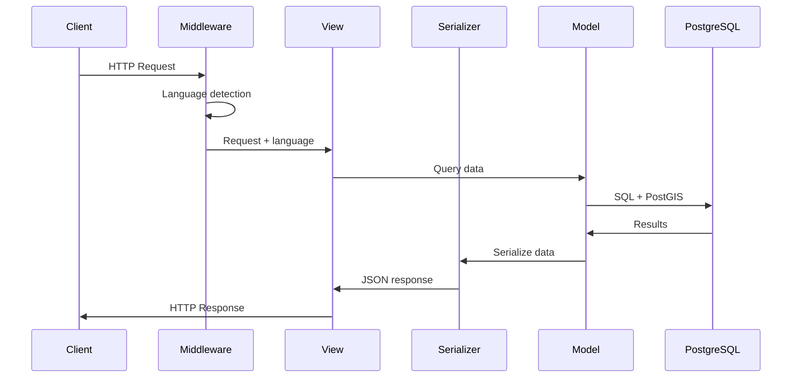
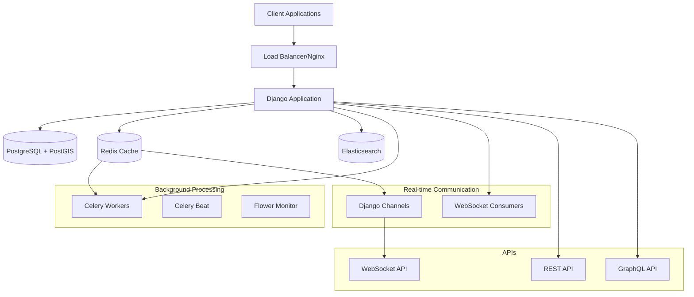

# Vue d'ensemble de l'Architecture

## 📋 Architecture Générale

L'application de tourisme Django suit une architecture modulaire basée sur les principes REST et les bonnes pratiques Django.

### 🏗️ Diagramme d'Architecture



## 🎯 Principes de Conception

### 1. Architecture en Couches

- **Présentation** : API REST + Django Admin
- **Logique métier** : Services et serializers
- **Accès aux données** : Models Django + PostGIS
- **Stockage** : PostgreSQL avec extensions spatiales

### 2. Séparation des Responsabilités

- **API** : Exposition des données via REST
- **Tourism** : Logique métier du tourisme
- **Core** : Utilitaires transversaux

### 3. Standards et Conventions

- **REST API** : Suivant les conventions REST
- **JSON-LD** : Support natif du format DataTourisme
- **PostGIS** : Données géospatiales optimisées
- **Multilingue** : Support i18n complet

## 📦 Structure du Projet

```
tourism_project/
├── api/                    # Application API REST
│   ├── urls.py            # Routes API
│   └── views.py           # Vues de base
├── core/                  # Utilitaires transversaux
│   ├── middleware.py      # Middlewares personnalisés
│   └── utils.py           # Fonctions utilitaires
├── tourism/               # Application métier principale
│   ├── models.py          # Modèles de données
│   ├── serializers.py     # Serializers REST
│   ├── services.py        # Services métier
│   ├── views.py           # Vues API
│   ├── admin.py           # Interface d'administration
│   └── management/        # Commandes de gestion
└── tourism_project/       # Configuration Django
    ├── settings.py        # Configuration
    └── urls.py            # Routage principal
```

## 🔄 Flux de Données

### 1. Import de Données JSON-LD



### 2. API REST Request



## 🌍 Support Multilingue

### Stratégie de Localisation

- **Modèles** : Champs JSON pour contenu multilingue
- **API** : Paramètre `lang` ou header `Accept-Language`
- **Fallback** : Français par défaut si langue non disponible
- **Langues supportées** : fr, en, de, es, it, nl

### Exemple de Structure

```json
{
  "name": {
    "fr": "Château de Versailles",
    "en": "Palace of Versailles",
    "de": "Schloss Versailles"
  }
}
```

## 🗺️ Fonctionnalités Géospatiales

### PostGIS Integration

- **Points géographiques** : Stockage WGS84 (SRID 4326)
- **Requêtes spatiales** : Distance, proximité, contenance
- **Index spatiaux** : Optimisation des performances
- **Projection** : Support des systèmes de coordonnées

### Types de Requêtes

```sql
-- Recherche par proximité
SELECT * FROM tourism_touristicresource 
WHERE ST_DWithin(location, ST_Point(longitude, latitude), radius);

-- Recherche dans une zone
SELECT * FROM tourism_touristicresource 
WHERE ST_Contains(polygon, location);
```

## 🚀 Performance et Scalabilité

### Optimisations Base de Données

- **Index GIN** : Recherche rapide dans JSON
- **Index spatiaux** : PostGIS GIST index
- **Index composites** : Multi-colonnes pour filtres
- **Pagination** : Limitation des résultats

### Stratégies de Cache

- **Cache de requêtes** : Redis pour les requêtes fréquentes
- **Cache de serialization** : Résultats API mis en cache
- **Invalidation** : Automatique lors des modifications

### Monitoring

- **Métriques Django** : Temps de réponse, erreurs
- **Métriques PostgreSQL** : Performance des requêtes
- **Logs structurés** : Facilitation du debugging

## 🔒 Sécurité

### Authentification et Autorisation

- **Django Admin** : Authentification par session
- **API REST** : Optionnel (lecture publique)
- **Permissions** : Basées sur les groupes Django

### Protection des Données

- **CORS** : Configuration pour cross-origin
- **Validation** : Validation stricte des données
- **Sanitization** : Nettoyage des entrées utilisateur

## 🐳 Déploiement

### Containerisation Docker

- **Application** : Image Django optimisée
- **Base de données** : PostGIS officiel
- **Orchestration** : Docker Compose
- **Volumes** : Persistance des données

### Environnements

- **Development** : Docker local avec auto-reload
- **Staging** : Réplique de production
- **Production** : Configuration optimisée

## 📊 Métriques et Monitoring

### Indicateurs Clés

- **Performance API** : Temps de réponse < 200ms
- **Disponibilité** : Uptime > 99.9%
- **Utilisation** : Nombre de requêtes/heure
- **Qualité données** : Pourcentage de ressources complètes

### Outils de Monitoring

- **Health checks** : Endpoints de santé
- **Logs centralisés** : Agrégation des logs
- **Alertes** : Notification automatique des problèmes

## 🚀 Architecture Évoluée (Phase 2)

L'architecture a évolué vers un système distribué moderne intégrant des services spécialisés pour répondre aux exigences de performance et de fonctionnalités avancées.

### Services Intégrés

- **✅ Cache Redis** : Cache distribué haute performance pour optimiser les temps de réponse
- **✅ Elasticsearch** : Moteur de recherche avancé avec support multilingue et géographique  
- **✅ GraphQL** : API flexible permettant aux clients de récupérer exactement les données nécessaires
- **✅ WebSockets** : Communication bidirectionnelle pour les mises à jour temps réel
- **✅ Celery** : Traitement asynchrone des tâches longues et périodiques
- **✅ Analytics** : Système de collecte et d'analyse des métriques d'utilisation

### Architecture Distribuée



### Flux de Données Avancés

**Lecture avec Cache** : Client → Cache Redis → Base de données (si cache miss) → Mise en cache → Retour client

**Recherche Avancée** : Client → GraphQL → Elasticsearch → Agrégation → Cache → Client

**Traitement Asynchrone** : Déclencheur → File Celery → Worker → Traitement → Notification → Cache update

**Communication Temps Réel** : Événement → WebSocket Consumer → Diffusion clients connectés

### Bénéfices de l'Architecture Distribuée

- **Performance** : Réduction des temps de réponse de 60-80% grâce au cache Redis
- **Scalabilité** : Capacité à gérer 10x plus de requêtes simultanées  
- **Recherche** : Moteur de recherche professionnel avec autocomplétion et géolocalisation
- **Flexibilité** : API GraphQL adaptable aux besoins spécifiques des clients
- **Expérience** : Mises à jour temps réel via WebSockets
- **Fiabilité** : Traitement asynchrone des tâches longues sans impact utilisateur

Cette architecture modulaire et distribuée permet une maintenance facile, un scaling horizontal et des extensions futures sans refactoring majeur.