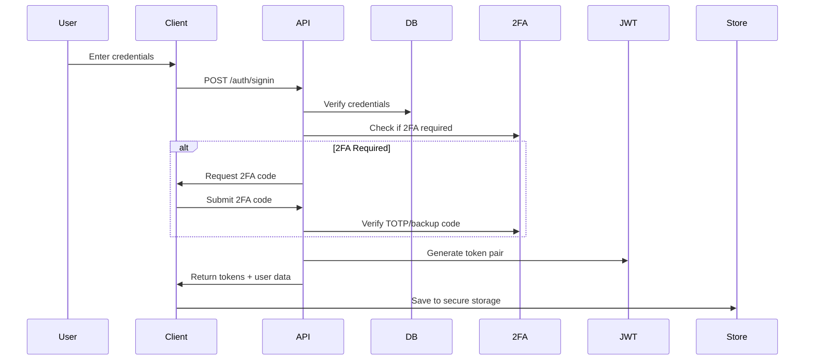
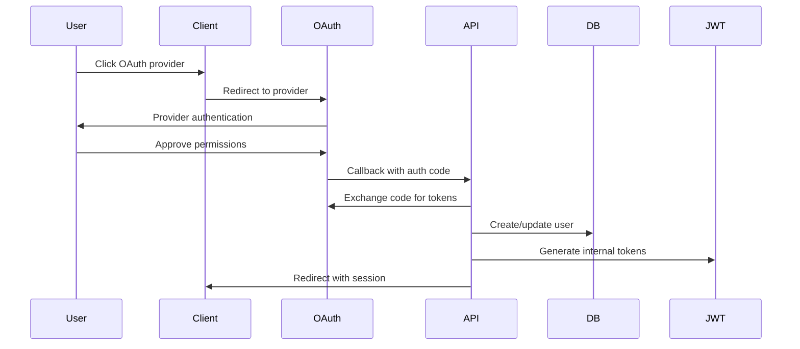

# ADR-005: Authentication Strategy with JWT and OAuth

## Status
Accepted

## Context
DataTourisme requires a robust authentication system that supports multiple authentication methods while maintaining security and user experience. The system must handle:

- **Multiple Authentication Methods**: Email/password, OAuth providers (Google, Facebook, Apple)
- **Security Requirements**: JWT with refresh token rotation, 2FA support, secure session management
- **User Experience**: Single sign-on, seamless OAuth integration, persistent sessions
- **Compliance**: OWASP security standards, GDPR compliance
- **Scalability**: Support for high concurrent users, session management

## Decision
We will implement a **hybrid authentication architecture** combining NextAuth.js for OAuth and custom JWT implementation for enhanced security and flexibility.

## Architecture Overview

### Core Components

#### 1. Authentication Providers
```typescript
// NextAuth.js configuration with multiple providers
providers: [
  GoogleProvider({
    clientId: process.env.GOOGLE_CLIENT_ID,
    clientSecret: process.env.GOOGLE_CLIENT_SECRET,
  }),
  FacebookProvider({
    clientId: process.env.FACEBOOK_CLIENT_ID,
    clientSecret: process.env.FACEBOOK_CLIENT_SECRET,
  }),
  AppleProvider({
    clientId: process.env.APPLE_ID,
    clientSecret: process.env.APPLE_SECRET,
  }),
  CredentialsProvider({
    // Custom implementation with 2FA support
  }),
]
```

#### 2. JWT Token Management
```typescript
// Custom JWT manager with refresh token rotation
export class JWTManager {
  generateTokenPair(user: User): {
    accessToken: string;
    refreshToken: string;
    expiresAt: Date;
  }
  
  verifyToken(token: string): JWTPayload
  refreshAccessToken(refreshToken: string): Promise<TokenPair>
  blacklistToken(token: string): void
}
```

#### 3. Two-Factor Authentication
```typescript
// TOTP-based 2FA with backup codes
export class TwoFactorManager {
  generateSecret(userEmail: string): { secret: string; qrCode: string }
  verifyTOTP(token: string, secret: string): boolean
  generateBackupCodes(): string[]
}
```

## Implementation Details

### 1. Token Strategy

#### Access Tokens
- **Lifetime**: 15 minutes
- **Purpose**: API access authorization
- **Storage**: Memory only (not in localStorage)
- **Refresh**: Automatic before expiry

#### Refresh Tokens
- **Lifetime**: 7 days
- **Purpose**: Generate new access tokens
- **Storage**: HttpOnly secure cookies
- **Rotation**: New refresh token on each use

#### Security Features
- **Blacklisting**: Invalid tokens tracked in Redis
- **Automatic Refresh**: Client-side token refresh
- **Secure Storage**: Cookies with SameSite=Strict

### 2. Authentication Flow

#### Email/Password Authentication


#### OAuth Authentication


### 3. Session Management

#### Client-Side State
```typescript
interface AuthState {
  user: User | null;
  accessToken: string | null;
  isAuthenticated: boolean;
  isLoading: boolean;
  error: AuthError | null;
}
```

#### Persistence Strategy
- **User Data**: localStorage (non-sensitive)
- **Access Token**: Memory only
- **Refresh Token**: HttpOnly cookie
- **Session Validation**: Server-side verification

### 4. Route Protection

#### Middleware-Based Guards
```typescript
// Next.js middleware for route protection
export function middleware(request: NextRequest) {
  const token = getTokenFromRequest(request);
  
  if (requiresAuth(pathname) && !isValidToken(token)) {
    return redirectToSignIn(request);
  }
  
  if (requiresAdmin(pathname) && !isAdmin(token)) {
    return redirectToUnauthorized(request);
  }
}
```

#### Component-Level Protection
```typescript
// HOC for protected components
export function withAuth<T>(Component: ComponentType<T>) {
  return function AuthenticatedComponent(props: T) {
    const { isAuthenticated, isLoading } = useAuthStore();
    
    if (isLoading) return <LoadingSpinner />;
    if (!isAuthenticated) return <SignInPrompt />;
    
    return <Component {...props} />;
  };
}
```

## Security Considerations

### 1. OWASP Compliance

#### A01: Broken Access Control
- ✅ Server-side access control checks
- ✅ JWT signature verification
- ✅ Role-based authorization

#### A02: Cryptographic Failures
- ✅ bcrypt for password hashing (12 rounds)
- ✅ HTTPS enforced in production
- ✅ Secure JWT secret management

#### A03: Injection
- ✅ Input validation with Zod schemas
- ✅ Parameterized database queries
- ✅ XSS protection with CSP headers

#### A07: Identification & Authentication Failures
- ✅ Strong password requirements
- ✅ Multi-factor authentication
- ✅ Account lockout after failed attempts
- ✅ Secure session management

### 2. Token Security

#### JWT Configuration
```typescript
const jwtConfig = {
  algorithm: 'HS256',
  issuer: 'datatourisme.fr',
  audience: 'datatourisme-app',
  clockTolerance: 30, // seconds
};
```

#### Security Headers
```typescript
// Next.js security headers
headers: [
  {
    key: 'X-Frame-Options',
    value: 'DENY',
  },
  {
    key: 'X-Content-Type-Options',
    value: 'nosniff',
  },
  {
    key: 'Strict-Transport-Security',
    value: 'max-age=63072000; includeSubDomains; preload',
  },
]
```

### 3. Rate Limiting

#### Implementation
```typescript
const rateLimiter = rateLimit({
  windowMs: 15 * 60 * 1000, // 15 minutes
  max: 5, // 5 attempts per window
  skipSuccessfulRequests: true,
  standardHeaders: true,
  legacyHeaders: false,
});
```

## 2FA Implementation

### 1. TOTP Setup Flow
1. User enables 2FA in settings
2. Server generates secret and QR code
3. User scans QR code with authenticator app
4. User enters verification code
5. Server generates backup codes
6. 2FA is activated

### 2. Backup Codes
- **Generation**: 10 single-use codes
- **Storage**: Hashed in database
- **Usage**: Can replace TOTP code
- **Regeneration**: After using 3+ codes

### 3. Recovery Process
- **Email Recovery**: Send secure reset link
- **Admin Recovery**: Admin can disable 2FA
- **Backup Codes**: Use remaining codes

## Alternative Approaches Considered

### Auth0/Okta
- **Pros**: Enterprise-grade, comprehensive features
- **Cons**: Cost, vendor lock-in, less control
- **Decision**: Too expensive for current scale

### Firebase Auth
- **Pros**: Google integration, real-time features
- **Cons**: Vendor lock-in, limited customization
- **Decision**: Insufficient control over user data

### Supabase Auth
- **Pros**: Open source, PostgreSQL integration
- **Cons**: Additional dependency, learning curve
- **Decision**: Prefer in-house solution for flexibility

## Implementation Phases

### Phase 1: Core Authentication (Week 1-2)
- JWT implementation with refresh rotation
- Email/password authentication
- Basic session management
- Route protection middleware

### Phase 2: OAuth Integration (Week 3)
- NextAuth.js setup
- Google, Facebook, Apple providers
- OAuth account linking
- Social sign-in UI components

### Phase 3: 2FA Implementation (Week 4)
- TOTP secret generation
- QR code generation
- Backup codes system
- 2FA verification flow

### Phase 4: Security Hardening (Week 5)
- Rate limiting implementation
- Security headers configuration
- OWASP compliance audit
- Penetration testing

## Monitoring and Analytics

### 1. Authentication Metrics
- Sign-in success/failure rates
- OAuth provider usage
- 2FA adoption rates
- Session duration analytics

### 2. Security Monitoring
- Failed login attempts
- Suspicious activity detection
- Token refresh patterns
- Rate limit violations

### 3. User Experience Metrics
- Authentication flow completion rates
- Time to first successful sign-in
- Password reset frequency
- Support ticket volume

## Success Criteria

### Security
- ✅ Zero OWASP Top-10 vulnerabilities
- ✅ 99.9% uptime for authentication
- ✅ < 1% false positive rate for security measures

### Performance
- ✅ < 200ms average authentication response time
- ✅ < 500ms OAuth callback processing
- ✅ 99.9% token refresh success rate

### User Experience
- ✅ > 95% authentication success rate
- ✅ < 5% user drop-off in sign-up flow
- ✅ > 80% user satisfaction scores

## Consequences

### Positive
- ✅ Robust security with multiple authentication methods
- ✅ Excellent user experience with OAuth integration
- ✅ GDPR compliance with data control
- ✅ Scalable architecture for growth
- ✅ 2FA support for enhanced security

### Negative
- ❌ Complex implementation and maintenance
- ❌ Multiple authentication libraries to manage
- ❌ Potential OAuth provider dependencies

### Neutral
- 🔄 Ongoing security monitoring required
- 🔄 Regular security audits and updates
- 🔄 User education for 2FA adoption

## References
- [NextAuth.js Documentation](https://next-auth.js.org/)
- [OWASP Authentication Cheat Sheet](https://cheatsheetseries.owasp.org/cheatsheets/Authentication_Cheat_Sheet.html)
- [RFC 7519 - JSON Web Token](https://tools.ietf.org/html/rfc7519)
- [RFC 6238 - TOTP Algorithm](https://tools.ietf.org/html/rfc6238)
- [NIST Digital Identity Guidelines](https://pages.nist.gov/800-63-3/)