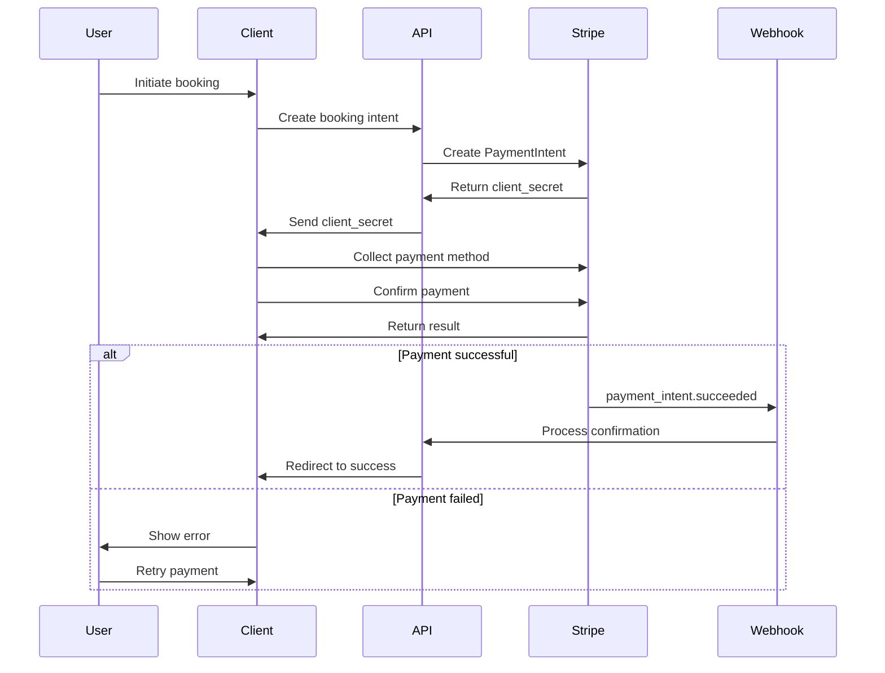

# ADR-006: Payment Integration Strategy with Stripe

## Status
Accepted

## Context
DataTourisme requires a comprehensive payment system that handles tourism bookings with complex requirements:

- **Multiple Payment Methods**: Cards, Apple Pay, Google Pay, SEPA Direct Debit
- **European Compliance**: Strong Customer Authentication (SCA/3DS2), PCI DSS
- **Complex Pricing**: Dynamic pricing, taxes, discounts, group rates
- **Booking Management**: Partial payments, refunds, cancellations
- **Revenue Optimization**: Reduced failed payments, conversion optimization

## Decision
We will implement **Stripe as our primary payment processor** with a comprehensive integration covering Elements, Payment Intents API, and webhooks for reliable payment processing.

## Architecture Overview

### Payment Processing Flow


## Core Components

### 1. Payment Intent Management
```typescript
export class StripePaymentManager {
  async createPaymentIntent(request: PaymentRequest): Promise<PaymentIntent> {
    // Create PaymentIntent with metadata
    return stripe.paymentIntents.create({
      amount: request.amount,
      currency: request.currency,
      payment_method_types: ['card', 'apple_pay', 'google_pay'],
      confirm: false,
      confirmation_method: 'automatic',
      metadata: {
        bookingId: request.bookingId,
        userId: request.userId,
      },
    });
  }
}
```

### 2. Stripe Elements Integration
```typescript
// Payment form with modern Elements
const PaymentForm = () => {
  const stripe = useStripe();
  const elements = useElements();

  const handleSubmit = async (event) => {
    const { error } = await stripe.confirmPayment({
      elements,
      confirmParams: {
        return_url: '/booking/confirmation',
      },
      redirect: 'if_required',
    });
  };

  return (
    <form onSubmit={handleSubmit}>
      <PaymentElement />
      <ExpressCheckoutElement />
      <button type="submit">Pay Now</button>
    </form>
  );
};
```

### 3. Webhook Event Processing
```typescript
// Secure webhook handling
export async function handleWebhook(event: Stripe.Event) {
  switch (event.type) {
    case 'payment_intent.succeeded':
      await confirmBooking(event.data.object);
      break;
    case 'payment_intent.payment_failed':
      await handlePaymentFailure(event.data.object);
      break;
    case 'charge.dispute.created':
      await handleDispute(event.data.object);
      break;
  }
}
```

## Payment Methods Strategy

### 1. Card Payments
#### Implementation
- **Stripe Elements**: Modern, secure card collection
- **3D Secure 2**: Automatic SCA compliance
- **Network Tokens**: Enhanced security for saved cards
- **Radar**: Fraud detection and prevention

#### Configuration
```typescript
const stripeConfig = {
  paymentMethodTypes: ['card'],
  captureMethod: 'automatic',
  confirmationMethod: 'automatic',
  setupFutureUsage: 'on_session', // Save for future use
};
```

### 2. Digital Wallets
#### Apple Pay
- **Setup**: Apple Developer account integration
- **Verification**: Domain verification files
- **UX**: Native Apple Pay button with brand guidelines

#### Google Pay
- **Setup**: Google Pay API integration
- **Configuration**: Merchant verification
- **UX**: Material Design compliant buttons

#### Implementation
```typescript
const expressCheckoutOptions = {
  applePay: {
    merchantIdentifier: process.env.APPLE_MERCHANT_ID,
  },
  googlePay: {
    merchantId: process.env.GOOGLE_MERCHANT_ID,
    buttonColor: 'black',
    buttonType: 'pay',
  },
};
```

### 3. European Payment Methods
#### SEPA Direct Debit
- **Use Case**: Large bookings, group reservations
- **Implementation**: Stripe SEPA Direct Debit
- **Compliance**: SEPA mandate collection

#### Local Methods
- **iDEAL** (Netherlands): Bank-to-bank transfers
- **Bancontact** (Belgium): Local card scheme
- **SOFORT** (Germany): Bank transfer
- **Giropay** (Germany): Bank transfer

## 3D Secure Implementation

### 1. Strong Customer Authentication (SCA)
```typescript
// Automatic 3DS2 handling
const paymentIntent = await stripe.paymentIntents.create({
  amount: amount,
  currency: 'eur',
  payment_method_types: ['card'],
  confirmation_method: 'automatic',
  // Stripe automatically applies SCA when required
});
```

### 2. Exemption Handling
- **Low-Value Payments**: < €30 automatic exemption
- **Merchant Initiated**: Recurring payments
- **Trusted Merchants**: Whitelist handling
- **Corporate Cards**: B2B exemptions

### 3. Fallback Strategies
```typescript
// Handle 3DS authentication
const { error, paymentIntent } = await stripe.confirmCardPayment(
  clientSecret,
  {
    payment_method: {
      card: cardElement,
      billing_details: billingDetails,
    },
  }
);

if (error) {
  // Handle authentication failure
  setError(error.message);
} else if (paymentIntent.status === 'succeeded') {
  // Payment successful
  redirectToConfirmation();
}
```

## Pricing and Tax Management

### 1. Dynamic Price Calculation
```typescript
export class PriceCalculator {
  calculateTotal(booking: BookingData): PricingBreakdown {
    let subtotal = this.calculateBasePrice(booking);
    
    // Apply time-based pricing
    subtotal *= this.getTimeModifier(booking.date, booking.timeSlot);
    
    // Apply discounts
    const discounts = this.applyDiscounts(subtotal, booking.discountCodes);
    subtotal -= discounts.total;
    
    // Calculate taxes
    const taxes = this.calculateTaxes(subtotal, booking.location);
    
    // Add fees
    const fees = this.calculateFees(booking);
    
    return {
      basePrice: this.calculateBasePrice(booking),
      subtotal,
      discounts,
      taxes,
      fees,
      total: subtotal + taxes.total + fees.total,
    };
  }
}
```

### 2. Tax Compliance
#### EU VAT Handling
- **Standard Rate**: 20% (France), varies by country
- **Reduced Rate**: Cultural activities may qualify
- **Digital Services**: B2C/B2B distinction
- **Cross-Border**: EU VAT ID validation

#### Implementation
```typescript
const taxCalculation = {
  'FR': { rate: 20, type: 'VAT' },
  'DE': { rate: 19, type: 'VAT' },
  'ES': { rate: 21, type: 'VAT' },
  'IT': { rate: 22, type: 'VAT' },
};

function calculateTax(amount: number, countryCode: string) {
  const config = taxCalculation[countryCode];
  return amount * (config.rate / 100);
}
```

### 3. Discount Management
```typescript
interface Discount {
  code: string;
  type: 'percentage' | 'fixed' | 'freeShipping';
  value: number;
  conditions: {
    minAmount?: number;
    validFrom?: Date;
    validTo?: Date;
    usageLimit?: number;
    applicableCategories?: string[];
  };
}
```

## Refund and Cancellation Strategy

### 1. Automated Refund Processing
```typescript
export class RefundManager {
  async processRefund(
    paymentIntentId: string,
    amount?: number,
    reason?: string
  ): Promise<Stripe.Refund> {
    return await stripe.refunds.create({
      payment_intent: paymentIntentId,
      amount, // Partial refund if specified
      reason,
      metadata: {
        processedBy: 'automated_system',
        timestamp: new Date().toISOString(),
      },
    });
  }
}
```

### 2. Cancellation Policies
#### Time-Based Refunds
```typescript
const cancellationPolicy = {
  rules: [
    { hoursBeforeStart: 168, refundPercentage: 100, fee: 0 },     // 7 days: 100%
    { hoursBeforeStart: 72, refundPercentage: 75, fee: 500 },    // 3 days: 75%
    { hoursBeforeStart: 24, refundPercentage: 50, fee: 1000 },   // 1 day: 50%
    { hoursBeforeStart: 0, refundPercentage: 0, fee: 0 },        // No refund
  ],
};
```

### 3. Dispute Management
- **Automatic Response**: Evidence collection
- **Documentation**: Booking confirmations, T&Cs
- **Communication**: Customer service integration
- **Prevention**: Clear policies, confirmation emails

## Security Implementation

### 1. PCI DSS Compliance
#### Stripe's PCI DSS Level 1
- **Card Data**: Never touches our servers
- **Tokenization**: Payment methods stored as tokens
- **Encryption**: All data encrypted in transit and at rest

#### Our Responsibilities
```typescript
// Secure webhook verification
function verifyWebhookSignature(payload: string, signature: string): boolean {
  const expectedSignature = stripe.webhooks.constructEvent(
    payload,
    signature,
    process.env.STRIPE_WEBHOOK_SECRET
  );
  return expectedSignature !== null;
}
```

### 2. Fraud Prevention
#### Stripe Radar
- **Machine Learning**: Adaptive fraud detection
- **Custom Rules**: Business-specific logic
- **Risk Scoring**: Real-time assessment
- **3DS Optimization**: Smart authentication

#### Implementation
```typescript
const paymentIntent = await stripe.paymentIntents.create({
  amount: amount,
  currency: 'eur',
  metadata: {
    email: user.email,
    ip_address: request.ip,
    user_agent: request.headers['user-agent'],
  },
});
```

### 3. Webhook Security
```typescript
// Secure webhook endpoint
export async function POST(request: Request) {
  const body = await request.text();
  const signature = request.headers.get('stripe-signature');
  
  let event;
  try {
    event = stripe.webhooks.constructEvent(
      body,
      signature,
      process.env.STRIPE_WEBHOOK_SECRET
    );
  } catch (err) {
    return new Response('Webhook signature verification failed', { 
      status: 400 
    });
  }
  
  // Process event with idempotency
  await processWebhookEvent(event);
  return new Response('OK');
}
```

## Performance Optimization

### 1. Payment Flow Optimization
#### Preload Optimization
```typescript
// Preload Stripe.js for faster checkout
import { loadStripe } from '@stripe/stripe-js';

const stripePromise = loadStripe(process.env.NEXT_PUBLIC_STRIPE_PUBLISHABLE_KEY);
```

#### Lazy Loading
```typescript
// Lazy load payment components
const PaymentForm = lazy(() => import('./PaymentForm'));
const ExpressCheckout = lazy(() => import('./ExpressCheckout'));
```

### 2. Conversion Optimization
#### Express Checkout
- **One-Click Payments**: Apple Pay, Google Pay
- **Saved Payment Methods**: Returning customers
- **Auto-Fill**: Address and payment info

#### Error Handling
```typescript
// Graceful error handling
function handlePaymentError(error: Stripe.StripeError) {
  switch (error.code) {
    case 'card_declined':
      return 'Your card was declined. Please try a different payment method.';
    case 'insufficient_funds':
      return 'Insufficient funds. Please check your account balance.';
    case 'authentication_required':
      return 'Please complete the authentication with your bank.';
    default:
      return 'Payment failed. Please try again.';
  }
}
```

## Testing Strategy

### 1. Payment Testing
#### Test Cards
```typescript
const testCards = {
  success: '4242424242424242',
  declined: '4000000000000002',
  sca_required: '4000002500003155',
  insufficient_funds: '4000000000009995',
};
```

#### Test Scenarios
- Successful payments
- Card declines
- 3DS authentication
- Network failures
- Webhook delivery

### 2. Integration Testing
```typescript
// Playwright E2E tests
test('complete payment flow', async ({ page }) => {
  await page.goto('/booking');
  await fillBookingDetails(page);
  await page.fill('[data-testid="card-number"]', '4242424242424242');
  await page.click('[data-testid="pay-button"]');
  await expect(page).toHaveURL('/booking/confirmation');
});
```

## Monitoring and Analytics

### 1. Payment Metrics
- **Success Rate**: Target > 95%
- **Decline Rate**: Monitor by reason
- **3DS Challenge Rate**: Optimize authentication
- **Refund Rate**: Track by category

### 2. Revenue Analytics
- **Conversion Rate**: Payment form to success
- **Average Transaction Value**: Trending analysis
- **Payment Method Mix**: User preferences
- **Geographical Performance**: Regional insights

### 3. Operational Metrics
```typescript
// Custom metrics tracking
const paymentMetrics = {
  track: (event: string, properties: any) => {
    analytics.track(`Payment ${event}`, {
      ...properties,
      timestamp: new Date().toISOString(),
      session_id: getSessionId(),
    });
  },
};
```

## Alternative Solutions Considered

### PayPal
- **Pros**: Wide acceptance, strong brand recognition
- **Cons**: Higher fees, limited customization, user flow friction
- **Decision**: Stripe offers better UX and developer experience

### Adyen
- **Pros**: Enterprise features, global coverage
- **Cons**: Complex setup, higher costs, overkill for current scale
- **Decision**: Stripe sufficient for current needs

### Square
- **Pros**: Integrated POS, competitive rates
- **Cons**: Limited European presence, fewer features
- **Decision**: Stripe better for European market

## Implementation Timeline

### Phase 1: Core Integration (Week 1-2)
- Stripe account setup and configuration
- Payment Intent API integration
- Basic card payment flow
- Webhook endpoint implementation

### Phase 2: Enhanced Features (Week 3-4)
- Express checkout (Apple Pay, Google Pay)
- Saved payment methods
- 3DS2 implementation and testing
- Refund processing automation

### Phase 3: Optimization (Week 5-6)
- Performance optimization
- Error handling improvement
- Analytics and monitoring setup
- Comprehensive testing

## Success Criteria

### Technical
- ✅ 99.9% payment processing uptime
- ✅ < 3 second payment confirmation
- ✅ > 95% payment success rate
- ✅ Zero PCI compliance violations

### Business
- ✅ < 2% cart abandonment at payment
- ✅ > 80% mobile payment success rate
- ✅ < 24 hour refund processing
- ✅ < 1% dispute rate

## Consequences

### Positive
- ✅ Industry-leading payment security and compliance
- ✅ Excellent user experience with modern payment methods
- ✅ Comprehensive fraud protection with Radar
- ✅ Flexible pricing and discount management
- ✅ Reliable webhook system for order processing

### Negative
- ❌ Transaction fees (2.9% + 30¢ for European cards)
- ❌ Stripe dependency for payment processing
- ❌ Complex 3DS2 implementation requirements

### Neutral
- 🔄 Ongoing compliance monitoring required
- 🔄 Regular security audits and updates
- 🔄 Payment method optimization based on analytics

## References
- [Stripe Developer Documentation](https://stripe.com/docs)
- [Strong Customer Authentication Guide](https://stripe.com/docs/strong-customer-authentication)
- [PCI DSS Compliance](https://stripe.com/docs/security/guide)
- [European Payment Methods](https://stripe.com/docs/payments/payment-methods/overview)
- [Stripe Radar Documentation](https://stripe.com/docs/radar)